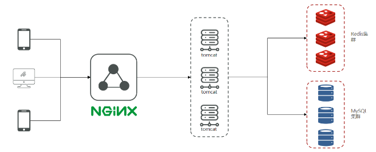

<div align="center">
<h1>店铺点评</h1>
</div>

<div align="center">
<b>基于 Spring Boot + Redis 的前后端店铺点评 APP</b>
</div>

<div align="center">


</div>

<div align="center">


</div>

## 项目简介
>  本项目是基于Spring Boot + Redis 的店捕点评 APP, 实现了找店铺=>写点评=>看热评=>点赞关注=>关注Feed流的完整业务流程。
>


主要工作：
- 短信登绿：使用 Redis 实现分布式 Session, 解决集群间登录态同步问题；使用 Hash 代替 String 来存储用户信息，节约了x%的内存并便于单字段的修改。（需要自己实际测试对比数据，节省内存的原因是不用保存序列化对象信息或者SON的一些额外字符串)
- 店铺查询：使用 Redis 对高频访问店铺进行缓存，降低 DB 压力同时提升 90% 的数据查询性能。
- 为方便其他业务后续使用缓存，使用泛型 + 函数式编程实现了通用缓存访问静态方法，并解决了缓存雪崩、缓存穿透等问题。
- 使用常量类全局管理 Redis Key 前缀、TTL 等，保证了键空间的业务隔离，减少冲突。
- 使用 Redis 的 Geo + Hash 数据结构分类存储附近商户，并使用 Geo Search 命令实现高性能商户查询及按距离排序。
- 使用 Redis List 数据结构存储用户点赞信息，并基于 ZSet 实现 TopN 点赞排行，实测相对于DB查询性能提升Xx%。(需要自己实际测试对比数据)
- 使用Redis Set数据结构实现用户关注、共同关注功能（交集），实测相对于 DB 查询性提升x%。(需要自己实际测试对比数据)
- 使用Redis BitMap实现用户连续签到统计功能，相对于传统关系库存储，节约ox%的内存并提升Xx%的查询性能。（需要自己实际测试对比数据）
- 在系统用户量不大的前提下，基于推模式实现关注Fed流，保证了新点评消息的及时可达，并减少用户访问的等待时间。 
- 优惠券秒杀：使用Redis+Lua脚本实现库存预检，并通过Stream队列实现订单的异步创建，解决了超卖问题、实现一人一单。实现相比传统数据库，秒杀性能提高了x%。(需要自己实际测试对比数据)

扩展的点
- 使用Redis+Token机制实现单点登录
- 对Redis的所有k©y设置N+n的过期时间，从而合理使用内存并防止缓存雪崩；针对热点店铺缓存，使用逻辑过期（或自动续期）机制解决缓存击穿问题，防止数据库宕机。
- 使用Redis的Geo+Hash数据结构分类存储附近商户，并使用Geo Search命令实现高性能商户查询及按距离排序，实测相对于传统DB查询+业务层计算的方式，性能提升x%。
- 使用Redis Set数据结构实现用户关注、共同关注功能（交集），实测相对于DB查询性提升Xx%,并使用Redis AOF+业务层日志防止关注数据丢失。（理解AOF和RDB持久化机制后再写这点）
- 基于Spring Scheduler实现对热点数据的定期检测和缓存预勋加载，提升用户的访问体验，并通过Redisson分布式锁保证集群中同一时刻的定时任务只执行一次。
- 关注Feed流可以改为推拉结合模式（活跃用户用推、普通用户用拉）
- 使用哨兵集群来提升Redis的读并发量、可用性和稳定性：或者使用Redis分片集群来提升Redis读写并发量、总存储容量，保障可用性和稳定性。
- 随着系统用户增多，使用Redis HyperLogLog代替DB来实现店铺和点评的UV统计，提高Xx%的查询分析性能并解决x%的内存空间。
## 项目功能
查看点评（热评）、发布点评、点赞

关注、查询关注的人发的帖子、查看好友共同关注

分类浏览店铺、查看附近的店铺

个人信息查看和管理
## 项目架构图

### 业务架构图


### 技术架构图



## 项目用到的技术
### 后端
***
#### Java相关
- Java 1.8
- JWT
#### Spring相关
- Spring Boot 2.X
- Spring MVC
#### 数据存储层
- MySQL:存储数据
- MyBatis Plus: 数据访问框架 
#### Redis相关：
- Spring-data-redis: 操作Redis
- Lettuce: 操作Redis的高级客户瑞
- Apache Commons Pool: 用于实现Redis连接池
- Redisson: 基于Redis的分布式数据网格
#### 工具库：
- HuToo:工具库合集
- Lombok:注解式代码生成工具
### 前端
***
- 原生HTML、CSS、JS三件套
- Vue2(渐进式使用)
- Element U川组件库
- axios请求库

## 启动项目
### 启动依赖服务
#### MySQL
```sql

```
#### Redis
```bash
```

### 后端
1. xxxx
2. xxxx
3. xxxx
### 前端
#### Nginx 启动
#### Serve 工具启动
## 参与贡献

1.  Fork 本仓库
2.  新建 Feat_xxx 分支
3.  提交代码
4.  新建 Pull Request


## 特技

1.  使用 Readme\_XXX.md 来支持不同的语言，例如 Readme\_en.md, Readme\_zh.md
2.  Gitee 官方博客 [blog.gitee.com](https://blog.gitee.com)
3.  你可以 [https://gitee.com/explore](https://gitee.com/explore) 这个地址来了解 Gitee 上的优秀开源项目
4.  [GVP](https://gitee.com/gvp) 全称是 Gitee 最有价值开源项目，是综合评定出的优秀开源项目
5.  Gitee 官方提供的使用手册 [https://gitee.com/help](https://gitee.com/help)
6.  Gitee 封面人物是一档用来展示 Gitee 会员风采的栏目 [https://gitee.com/gitee-stars/](https://gitee.com/gitee-stars/)
